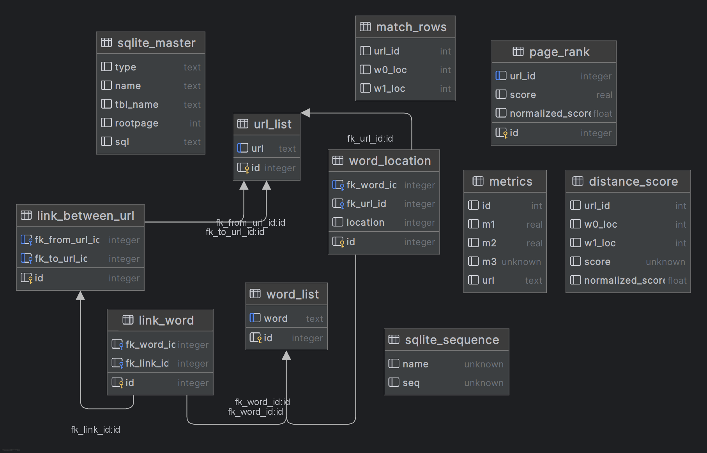

### Индексатор и поисковый паук

Здесь происходит создание таблиц базы данных в файле creator, индексирование ссылок в файле crawler и реализация
searcher по подобию поисковых систем по метрикам PageRank и расстояния.



Для работы нужно поочерёдно запустить

```bash
python creator.py
python crawler.py
python searcher.py
```

Аргументы изменяются внутри программы, в main.